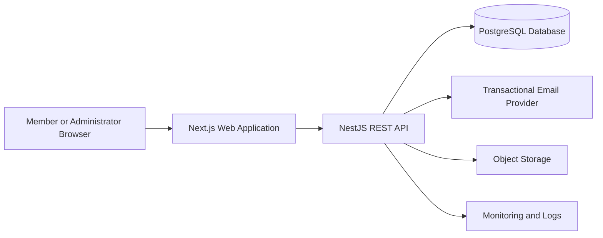
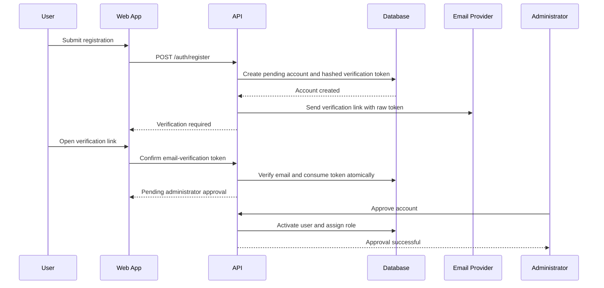
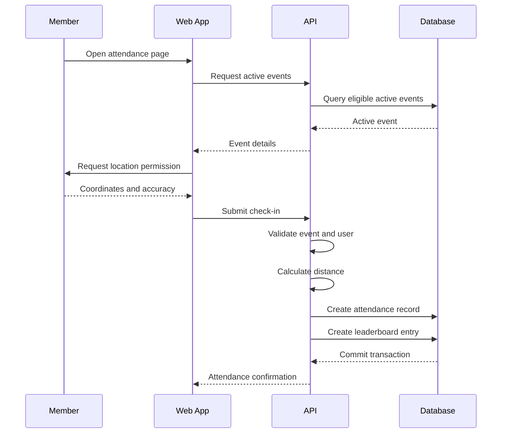
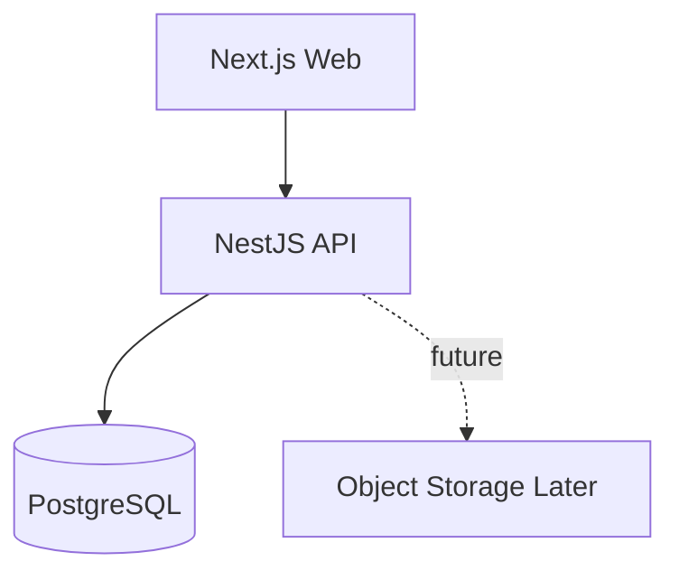
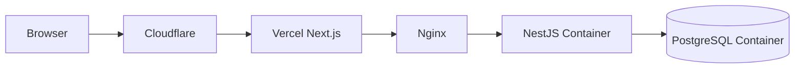

# System Architecture Document

## Arrows Church Management System (ACMS)

**Version:** 1.0  
**Status:** Draft  
**Architecture Style:** Modular monolith  
**Deployment Model:** Web frontend + REST API + PostgreSQL  

---

## 1. Purpose

This document defines the technical architecture for Version 1 of the Arrows Church Management System.

The architecture is designed to support:

- Public member registration
- Administrator approval
- Role-based access control
- Member and department management
- Event scheduling
- Geofence-based attendance
- Leaderboards
- Reports
- Audit logging

The first release will serve Arrows Church only.

---

## 2. Architecture Goals

The system should be:

- Easy to understand
- Secure by default
- Modular
- Testable
- Maintainable
- Deployable with Docker
- Suitable for learning backend engineering
- Able to grow without introducing premature complexity

The architecture shall avoid:

- Microservices
- Kubernetes
- Event-driven infrastructure
- Multiple databases
- Native mobile applications
- Unnecessary distributed systems

---

## 3. High-Level Architecture



### Main Components

| Component | Responsibility |
|---|---|
| Next.js web application | User interface, forms, dashboards, geolocation requests |
| NestJS REST API | Business logic, validation, authorization, geofence checks |
| PostgreSQL | Persistent relational data |
| Drizzle ORM | Database schema, queries, migrations |
| Transactional email provider | Email verification and password-reset delivery |
| Object storage | Profile images and future uploaded files |
| Docker | Local and production service packaging |
| Nginx | Production reverse proxy |
| Sentry/logging | Error monitoring and diagnostics |

---

## 4. Recommended Repository Structure

For Version 1, use a monorepo-style structure:

```text
arrows-church-management-system/
├── apps/
│   ├── web/
│   └── api/
├── docs/
│   ├── PRD.md
│   ├── SRS.md
│   ├── ERD.md
│   ├── API.md
│   └── ARCHITECTURE.md
├── packages/
│   └── shared/
├── docker/
├── AGENTS.md
├── README.md
├── package.json
└── docker-compose.yml
```

### `apps/web`

Contains:

- Next.js application
- Member dashboard
- Administrator dashboard
- Forms
- Geolocation integration
- API client
- UI components

### `apps/api`

Contains:

- NestJS API
- Authentication
- Authorization
- Business rules
- Drizzle database access
- Attendance verification
- Reports
- Audit logging

### `packages/shared`

May contain:

- Shared TypeScript types
- Shared enums
- Shared Zod schemas
- API response types
- Constants

Do not place backend secrets or server-only logic inside the shared package.

---

## 5. Frontend Architecture

## 5.1 Technology

- Next.js
- React
- TypeScript
- Tailwind CSS
- shadcn/ui
- TanStack Query
- React Hook Form
- Zod

## 5.2 Responsibilities

The frontend shall:

- Render public and protected pages
- Collect registration information
- Request browser location permission
- Send check-in requests
- Display account approval status
- Display dashboards and reports
- Handle API loading and error states
- Protect routes at the user-interface level

The frontend must not make final security or attendance decisions.

## 5.3 Suggested Frontend Structure

```text
apps/web/src/
├── app/
│   ├── (public)/
│   ├── (auth)/
│   ├── (member)/
│   └── (admin)/
├── components/
│   ├── ui/
│   ├── layout/
│   └── shared/
├── features/
│   ├── auth/
│   ├── attendance/
│   ├── departments/
│   ├── events/
│   ├── leaderboards/
│   └── reports/
├── hooks/
├── lib/
│   ├── api/
│   ├── auth/
│   └── validation/
└── types/
```

## 5.4 Route Groups

Suggested routes:

```text
/
├── login
├── register
├── approval-status
├── dashboard
├── attendance
├── attendance/history
├── departments
├── events
├── leaderboards
├── profile
└── admin
    ├── dashboard
    ├── registrations
    ├── members
    ├── departments
    ├── events
    ├── attendance
    ├── reports
    └── audit-logs
```

---

## 6. Backend Architecture

## 6.1 Architecture Style

Use a modular monolith.

Each business capability shall be implemented as a NestJS module.

```text
apps/api/src/
├── auth/
├── users/
├── members/
├── departments/
├── events/
├── attendance/
├── absence-requests/
├── leaderboards/
├── reports/
├── audit-logs/
├── church/
├── database/
├── common/
├── config/
└── main.ts
```

## 6.2 Module Responsibilities

### Auth Module

Responsible for:

- Registration
- Email verification
- Login
- Password hashing
- Access tokens
- Refresh-token rotation
- Logout
- Password reset
- Account-action token issuance, hashing, expiry, and consumption
- Account-status checks

### Users Module

Responsible for:

- Account lifecycle
- Account status
- User lookup
- Suspension and reactivation

### Members Module

Responsible for:

- Member profiles
- Profile updates
- Member listing
- Membership status

### Departments Module

Responsible for:

- Departments
- Membership assignments
- Department leaders
- Department access restrictions

### Events Module

Responsible for:

- Event creation
- Event scheduling
- Attendance windows
- Event eligibility
- Event departments

### Attendance Module

Responsible for:

- Active-event validation
- Geofence verification
- Duplicate prevention
- Punctuality status
- Manual attendance
- Corrections

### Absence Requests Module

Responsible for:

- Request submission
- Approval and rejection
- Excused attendance handling

### Leaderboards Module

Responsible for:

- Percentage-based individual and department rankings
- Attendance and punctuality rate calculation
- Minimum-participation qualification
- Points ledger as a secondary motivational metric
- Individual rankings
- Department rankings
- Attendance streaks
- Leaderboard visibility settings

### Reports Module

Responsible for:

- Attendance summaries
- Department reports
- Repeated absences
- CSV export

### Audit Logs Module

Responsible for:

- Administrative action logs
- Attendance correction logs
- Approval records
- Sensitive-field redaction

---

## 7. Backend Layering

Each module should use the following layers:

```text
Controller
    ↓
Service
    ↓
Repository
    ↓
Database
```

### Controller

Responsible for:

- Receiving HTTP requests
- Reading route parameters
- Reading authenticated-user context
- Passing validated input to services
- Returning responses

Controllers must remain thin.

### Service

Responsible for:

- Business rules
- Transactions
- Authorization decisions related to domain behavior
- Coordination between repositories

### Repository

Responsible for:

- Database queries
- Drizzle ORM operations
- Query composition
- Persistence-specific logic

### DTO and Validation Layer

Responsible for:

- Request validation
- Type conversion
- Field-level errors
- API documentation metadata

---

## 8. Database Architecture

## 8.1 Technology

- PostgreSQL
- Drizzle ORM
- Drizzle Kit
- SQL migrations

## 8.2 Schema Source

The database design shall be documented in:

```text
docs/ERD.md
docs/database.dbml
```

The implementation source shall be:

```text
apps/api/src/database/schema/
```

Suggested structure:

```text
schema/
├── churches.ts
├── users.ts
├── roles.ts
├── members.ts
├── departments.ts
├── events.ts
├── attendance.ts
├── absence-requests.ts
├── leaderboards.ts
├── refresh-tokens.ts
├── account-action-tokens.ts
├── audit-logs.ts
└── index.ts
```

## 8.3 Migration Rules

- Every schema change requires a migration.
- Production schema changes must not use destructive push commands.
- Migrations must be committed to Git.
- Migrations must be tested before deployment.
- Database backups should exist before destructive changes.

---

## 9. Authentication Architecture

## 9.1 Registration Flow



## 9.2 Login Flow

```text
User submits credentials
        ↓
API verifies email and password
        ↓
API checks account status
        ↓
ACTIVE account receives access and refresh tokens
        ↓
Pending user receives limited approval-status access
```

## 9.3 Token Strategy

Recommended:

- Access token: short-lived
- Refresh token: longer-lived
- Refresh token stored in an HTTP-only secure cookie
- Refresh-token hash stored in PostgreSQL
- Refresh token rotated on every refresh
- Logout revokes the active refresh token

## 9.4 Password Security

Use Argon2.

Never:

- Store plain-text passwords
- Log password values
- Return password hashes
- Implement custom cryptography

## 9.5 Account Action Tokens

Use a shared account-action token service for email verification and password reset.

Issuance flow:

```text
Generate a cryptographically secure random token
        ↓
Hash the token with SHA-256
        ↓
Revoke prior unused tokens of the same type
        ↓
Store only the hash and expiry
        ↓
Send the raw token through the transactional email provider
```

Consumption flow:

```text
Hash the submitted token
        ↓
Lock and validate the matching database row
        ↓
Reject expired, used, or revoked tokens
        ↓
Apply the account action and mark the token used in one transaction
```

Policy:

- Email-verification tokens expire after 24 hours.
- Password-reset tokens expire after 30 minutes.
- Raw tokens must never be stored, logged, or returned in API response data.
- Verification and reset request endpoints use generic responses to resist account enumeration.
- Email must be verified before an administrator can approve an account.
- Successful password reset revokes every refresh-token session for the user.
- Concurrent consumption attempts must allow at most one success.
- Email delivery shall be accessed through an application interface so providers can be changed without modifying authentication business logic.

---

## 10. Authorization Architecture

Use:

- JWT authentication guard
- Account-status guard
- Role guard
- Department-scope checks

Authorization flow:

```text
Authenticated?
    ↓
Account ACTIVE?
    ↓
Role allowed?
    ↓
Resource scope allowed?
    ↓
Execute action
```

Examples:

- Members view only their own attendance.
- Department leaders view only assigned departments.
- Administrators view church-wide records.
- Only the Super Administrator views audit logs.

Frontend route protection is for user experience only.

The backend must enforce every permission.

---

## 11. Attendance Architecture

## 11.1 Check-In Flow



## 11.2 Geofence Verification

The frontend sends:

- Event ID
- Latitude
- Longitude
- Accuracy

The backend verifies:

- Active account
- Event eligibility
- Attendance window
- Coordinate validity
- Accuracy threshold
- Distance from event location
- Duplicate attendance

The backend calculates distance using the Haversine formula.

## 11.3 Attendance Transaction

The check-in transaction should include:

```text
Create attendance record
Create leaderboard ledger entry
Return attendance result
```

The database unique constraint on:

```text
(event_id, member_id)
```

prevents duplicate attendance.

## 11.4 Punctuality Evidence

Geolocation check-ins shall derive `punctuality_status` from server time and the event thresholds.

Manual attendance may record `EARLY`, `ON_TIME`, or `LATE` only when the authorized actor can verify the arrival category. Otherwise, manual attendance remains valid for the attendance rate and is neutral in the punctuality-rate calculation.

---

## 11.5 Leaderboard Architecture

### 11.5.1 Official Score

The Leaderboards Module shall calculate official rankings from attendance source records:

```text
Attendance Rate =
Attended Eligible Events / Expected Eligible Events * 100

Punctuality Rate =
Early and On-Time Attendances / Attendances with Known Punctuality * 100

Official Score =
(Attendance Rate * 0.70) + (Punctuality Rate * 0.30)
```

When the selected population has no attendance with known punctuality, the official score shall equal the attendance rate. Unknown manual-attendance punctuality is neutral rather than zero.

Raw point totals and streaks are secondary values and shall not alter the official score.

Each valid attendance shall create a 10-point member ledger entry. All other outcomes create no positive points. Version 1 uses no negative points or streak bonuses.

### 11.5.2 Eligibility and Qualification

- Members require at least three expected events in the selected period for a numbered rank.
- Departments require at least three applicable events in the selected period for a numbered rank.
- Approved absences, unresolved reviews, cancelled events, and ineligible events are excluded from denominators.
- Manual attendance with unknown punctuality is excluded only from the punctuality denominator.
- Inactive and suspended members are excluded from current public rankings without deleting historical results.

### 11.5.3 Department Calculation

Department rates shall be calculated from expected member-event attendance slots. Raw department totals and averages of individual scores shall not determine rank.

### 11.5.4 Streaks

Streaks shall be derived from ordered eligible attendance history:

- Attended events extend the attendance streak.
- Early and on-time events extend the punctuality streak.
- Approved absences pause rather than break a streak.
- Actual absences break the applicable streak.
- Streaks are displayed separately and do not award Version 1 score bonuses.

### 11.5.5 Periods, Privacy, and History

- Monthly is the default period; weekly, quarterly, and yearly views are supported.
- Period changes affect query boundaries only and never delete historical source records.
- Public member rankings use privacy-conscious display names.
- Lowest-performer lists are not exposed to members.
- Administrators may disable member-visible leaderboards without disabling personal attendance statistics.
- Results may be computed on demand initially; caching should be introduced only after measurement shows it is necessary.

---

## 12. API Communication

The frontend communicates with the backend through REST.

```text
Next.js
   ↓ HTTPS JSON
NestJS API
```

Use:

- TanStack Query for server-state fetching
- Central API client
- Structured error handling
- Retry only for safe requests
- No automatic retry for attendance submissions unless idempotency is guaranteed

Suggested API client structure:

```text
apps/web/src/lib/api/
├── client.ts
├── auth.ts
├── attendance.ts
├── departments.ts
├── events.ts
├── members.ts
└── reports.ts
```

---

## 13. Standard API Response

```json
{
  "success": true,
  "message": "Operation completed successfully.",
  "data": {}
}
```

Error response:

```json
{
  "success": false,
  "message": "Validation failed.",
  "error": {
    "code": "VALIDATION_ERROR",
    "details": []
  }
}
```

A global NestJS exception filter should produce consistent error responses.

---

## 14. Configuration Management

Use environment variables for:

```text
NODE_ENV
PORT
DATABASE_URL
JWT_ACCESS_SECRET
JWT_REFRESH_SECRET
ACCESS_TOKEN_TTL
REFRESH_TOKEN_TTL
CORS_ORIGIN
FRONTEND_URL
STORAGE_ENDPOINT
STORAGE_ACCESS_KEY
STORAGE_SECRET_KEY
EMAIL_FROM
EMAIL_PROVIDER
EMAIL_API_KEY
SENTRY_DSN
```

Files:

```text
.env
.env.example
```

Only `.env.example` shall be committed.

Configuration must be validated when the API starts.

---

## 15. Logging and Monitoring

## 15.1 Application Logging

Recommended:

- Pino
- NestJS Pino integration
- JSON logs in production
- Human-readable logs in development

Log:

- Authentication failures
- Email-verification completion
- Password-reset completion and session revocation
- Registration approvals
- Attendance decisions
- Manual attendance
- Attendance corrections
- Unexpected errors

Do not log:

- Passwords
- Raw access tokens
- Raw refresh tokens
- Secret keys

## 15.2 Monitoring

Recommended:

- Sentry for application errors
- Uptime Kuma for service health checks
- Docker logs
- PostgreSQL backup monitoring

Health endpoint:

```http
GET /health
```

Expected response:

```json
{
  "status": "ok",
  "database": "connected",
  "timestamp": "2026-07-22T00:00:00.000Z"
}
```

---

## 16. Security Architecture

The system shall use:

- HTTPS
- Secure password hashing
- JWT validation
- Refresh-token rotation
- Backend authorization
- Rate limiting
- Input validation
- CORS restrictions
- Helmet security headers
- Audit logging
- Database constraints
- Secure cookies
- Parameterized database queries

Sensitive administrative actions should create audit logs.

---

## 17. Testing Architecture

## 17.1 Unit Tests

Test:

- Password rules
- Attendance status calculation
- Haversine distance
- Geofence validation
- Leaderboard scoring
- Absence handling
- Role authorization helpers

## 17.2 Integration Tests

Test:

- Registration
- Approval
- Login
- Token refresh
- Email verification and token reuse prevention
- Password reset, expiry, and session revocation
- Event creation
- Attendance check-in
- Duplicate prevention
- Manual attendance
- Report generation

Use a dedicated test database.

## 17.3 End-to-End Tests

Use Playwright for:

- Public registration
- Pending status
- Administrator approval
- Login
- Location permission
- Successful check-in
- Outside-geofence rejection
- Attendance history

---

## 18. Docker Architecture

Development services:



Suggested `docker-compose.yml` services:

```text
web
api
db
```

During early frontend development, the web application may run outside Docker while API and PostgreSQL run in containers.

---

## 19. Deployment Architecture

Recommended Version 1 deployment:

```text
Frontend:
Vercel

Backend:
VPS + Docker

Database:
PostgreSQL container on VPS

Reverse Proxy:
Nginx

DNS and SSL:
Cloudflare
```

Production flow:



Alternative:

The frontend, backend, and database may all run on the VPS later.

---

## 20. CI/CD Architecture

Use GitHub Actions.

### Frontend Pipeline

```text
Install dependencies
Run linting
Run type checking
Run tests
Build Next.js
Deploy to Vercel
```

### Backend Pipeline

```text
Install dependencies
Run linting
Run type checking
Run unit tests
Run integration tests
Build Docker image
Push image
Deploy to VPS
Run migrations
Run health check
```

Database migrations must run before the new application version receives traffic when schema compatibility requires it.

---

## 21. Backup and Recovery

For Version 1:

- Daily PostgreSQL backups
- Retain multiple backup versions
- Store backups outside the database container
- Test restoration periodically
- Back up uploaded files separately
- Document recovery procedures

A container is not a backup.

---

## 22. Scalability Strategy

Version 1 uses a modular monolith.

Scale in this order:

1. Improve database indexes
2. Add caching only where measurements justify it
3. Add background jobs for expensive reports or notifications
4. Add Redis and BullMQ when required
5. Separate services only if operational scale demands it

Do not introduce microservices simply because the application grows in features.

---

## 23. Architecture Decisions

### Decision 1: Modular Monolith

**Reason:** Easier to build, test, deploy, and learn than microservices.

### Decision 2: REST API

**Reason:** Clear contract between Next.js and NestJS.

### Decision 3: PostgreSQL

**Reason:** The application contains highly relational data.

### Decision 4: Drizzle ORM

**Reason:** Strong TypeScript support and transparent SQL-oriented development.

### Decision 5: Geolocation Verified by Backend

**Reason:** The browser must not make the final attendance decision.

### Decision 6: Public Registration with Admin Approval

**Reason:** Reduces onboarding friction while keeping access controlled.

### Decision 7: Role-Based Access for Version 1

**Reason:** A full permission system is unnecessary for the MVP.

### Decision 8: Single Church for Version 1

**Reason:** Multi-tenancy would add complexity before the core product is validated.

---

## 24. Architecture Constraints

Version 1 shall not include:

- Public church registration
- Multi-tenant architecture
- Native mobile apps
- Microservices
- Kubernetes
- Redis unless required later
- BullMQ unless required later
- Continuous location tracking
- Face recognition
- Device locking or browser fingerprinting
- QR-code attendance verification
- Offline attendance synchronization

---

## 25. Implementation Order

1. Repository structure
2. NestJS API initialization
3. PostgreSQL with Docker
4. Drizzle setup
5. Database schema and migrations
6. Authentication module
7. Account approval workflow
8. Member module
9. Department module
10. Event module
11. Attendance module
12. Leaderboard module
13. Reports module
14. Next.js integration
15. Automated testing
16. Production deployment

---

## 26. Next Document

The next planning document should be:

```text
docs/ROADMAP.md
```

It should convert the architecture and requirements into milestones, tasks, and delivery phases.
