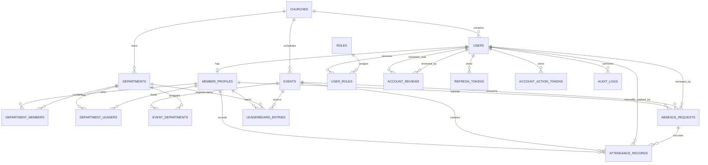

# Database Design and Entity Relationship Diagram

## Arrows Church Management System (ACMS)

**Version:** 1.0  
**Status:** Draft  
**Database:** PostgreSQL  
**ORM:** Drizzle ORM  

---

## 1. Purpose

This document defines the initial relational database design for the Arrows Church Management System.

The database supports:

- Public user registration
- Administrator approval
- Role-based access control
- Members and departments
- Church events
- Geofence-based attendance
- Manual attendance
- Absence requests
- Leaderboards
- Audit logging

The first version serves Arrows Church only, but selected tables include `church_id` to simplify future support for multiple branches or churches.

---

## 2. Design Principles

- Use UUID primary keys.
- Use foreign-key constraints.
- Use timestamps in UTC.
- Use database-level unique constraints for critical business rules.
- Preserve historical attendance records.
- Avoid hard deletion of important records.
- Use status fields for lifecycle management.
- Store only necessary location evidence.
- Keep authentication data separate from member profile data.
- Use join tables for many-to-many relationships.

---

## 3. Entity Relationship Diagram



---

## 4. Enumerations

### 4.1 Account Status

```text
PENDING_APPROVAL
ACTIVE
REJECTED
SUSPENDED
ARCHIVED
```

### 4.2 Membership Status

```text
ACTIVE
INACTIVE
ON_LEAVE
ARCHIVED
```

### 4.3 Event Status

```text
DRAFT
SCHEDULED
ACTIVE
COMPLETED
CANCELLED
```

### 4.4 Attendance Status

```text
EARLY
ON_TIME
LATE
ABSENT
EXCUSED
MANUAL
PENDING_REVIEW
INVALID
```

### 4.5 Attendance Method

```text
GEOLOCATION
MANUAL
SYSTEM
```

### 4.6 Attendance Punctuality Status

```text
EARLY
ON_TIME
LATE
```

This value is calculated from server time for geolocation check-ins. For manual attendance, it is recorded only when an authorized officer can verify the member's arrival category.

### 4.7 Absence Request Status

```text
PENDING
APPROVED
REJECTED
NEEDS_CLARIFICATION
CANCELLED
```

### 4.8 Review Decision

```text
APPROVED
REJECTED
SUSPENDED
REACTIVATED
```

### 4.9 Leaderboard Subject Type

```text
MEMBER
DEPARTMENT
```

### 4.10 Leaderboard Period

```text
WEEKLY
MONTHLY
QUARTERLY
YEARLY
```

### 4.11 Account Action Token Type

```text
EMAIL_VERIFICATION
PASSWORD_RESET
```

---

# 5. Tables

## 5.1 `churches`

Stores the church organization.

| Column | Type | Constraints | Description |
|---|---|---|---|
| `id` | UUID | Primary key | Church identifier |
| `name` | VARCHAR(150) | Not null | Church name |
| `slug` | VARCHAR(100) | Unique, not null | URL-safe identifier |
| `logo_url` | TEXT | Nullable | Church logo |
| `email` | VARCHAR(255) | Nullable | Church email |
| `phone` | VARCHAR(30) | Nullable | Church phone |
| `address` | TEXT | Nullable | Church address |
| `timezone` | VARCHAR(64) | Not null, default Africa/Accra | IANA timezone for event dates and reporting periods |
| `latitude` | DECIMAL(9,6) | Nullable | Default church latitude |
| `longitude` | DECIMAL(9,6) | Nullable | Default church longitude |
| `geofence_radius_meters` | INTEGER | Not null, default 100 | Default attendance radius |
| `leaderboards_enabled` | BOOLEAN | Not null, default true | Member-visible leaderboard setting |
| `is_active` | BOOLEAN | Not null, default true | Organization status |
| `created_at` | TIMESTAMPTZ | Not null | Creation time |
| `updated_at` | TIMESTAMPTZ | Not null | Last update |

For version 1, this table will contain one Arrows Church record.

---

## 5.2 `users`

Stores authentication and account lifecycle information.

| Column | Type | Constraints | Description |
|---|---|---|---|
| `id` | UUID | Primary key | User identifier |
| `church_id` | UUID | FK → churches.id, not null | Associated church |
| `email` | VARCHAR(255) | Unique, not null | Login email |
| `phone` | VARCHAR(30) | Unique, nullable | User phone |
| `password_hash` | TEXT | Not null | Argon2 password hash |
| `account_status` | account_status | Not null, default PENDING_APPROVAL | Account lifecycle |
| `email_verified_at` | TIMESTAMPTZ | Nullable | Email verification time |
| `last_login_at` | TIMESTAMPTZ | Nullable | Last successful login |
| `failed_login_attempts` | INTEGER | Not null, default 0 | Failed login count |
| `locked_until` | TIMESTAMPTZ | Nullable | Temporary lock expiration |
| `created_at` | TIMESTAMPTZ | Not null | Registration time |
| `updated_at` | TIMESTAMPTZ | Not null | Last update |
| `archived_at` | TIMESTAMPTZ | Nullable | Archive time |

### Constraints

- Normalize emails to lowercase.
- Phone numbers should be stored in a normalized international format.
- Rejected and suspended users retain their records.
- Password hashes must never be returned through the API.

---

## 5.3 `member_profiles`

Stores church-member information separately from authentication data.

| Column | Type | Constraints | Description |
|---|---|---|---|
| `id` | UUID | Primary key | Member identifier |
| `user_id` | UUID | Unique FK → users.id, not null | Related user |
| `membership_number` | VARCHAR(50) | Unique, nullable | Church member number |
| `first_name` | VARCHAR(100) | Not null | First name |
| `last_name` | VARCHAR(100) | Not null | Last name |
| `other_names` | VARCHAR(150) | Nullable | Other names |
| `profile_photo_url` | TEXT | Nullable | Profile image |
| `requested_department_id` | UUID | Nullable FK → departments.id | Registration preference |
| `primary_department_id` | UUID | Nullable FK → departments.id | Confirmed primary department |
| `membership_status` | membership_status | Not null, default ACTIVE | Member status |
| `joined_at` | DATE | Nullable | Church joining date |
| `approved_at` | TIMESTAMPTZ | Nullable | Account approval time |
| `approved_by` | UUID | Nullable FK → users.id | Approving administrator |
| `created_at` | TIMESTAMPTZ | Not null | Creation time |
| `updated_at` | TIMESTAMPTZ | Not null | Last update |

A requested department does not grant membership automatically.

---

## 5.4 `roles`

Stores system roles.

| Column | Type | Constraints | Description |
|---|---|---|---|
| `id` | UUID | Primary key | Role identifier |
| `name` | VARCHAR(80) | Unique, not null | Role name |
| `description` | TEXT | Nullable | Role explanation |
| `is_system_role` | BOOLEAN | Not null, default true | Protected role |
| `created_at` | TIMESTAMPTZ | Not null | Creation time |

Initial roles:

```text
SUPER_ADMIN
ADMIN
DEPARTMENT_LEADER
ATTENDANCE_OFFICER
MEMBER
```

---

## 5.5 `user_roles`

Many-to-many relationship between users and roles.

| Column | Type | Constraints | Description |
|---|---|---|---|
| `id` | UUID | Primary key | Assignment identifier |
| `user_id` | UUID | FK → users.id, not null | User |
| `role_id` | UUID | FK → roles.id, not null | Role |
| `assigned_by` | UUID | Nullable FK → users.id | Assigning administrator |
| `assigned_at` | TIMESTAMPTZ | Not null | Assignment time |

### Unique Constraint

```text
UNIQUE (user_id, role_id)
```

Trusted roles must never be assigned during public registration.

---

## 5.6 `account_reviews`

Records administrative account decisions.

| Column | Type | Constraints | Description |
|---|---|---|---|
| `id` | UUID | Primary key | Review identifier |
| `user_id` | UUID | FK → users.id, not null | Reviewed user |
| `reviewed_by` | UUID | FK → users.id, not null | Administrator |
| `previous_status` | account_status | Not null | Previous status |
| `new_status` | account_status | Not null | New status |
| `decision` | review_decision | Not null | Administrative decision |
| `reason` | TEXT | Nullable | Reason or note |
| `created_at` | TIMESTAMPTZ | Not null | Decision time |

This table creates a history of approvals, rejections, suspensions, and reactivations.

---

## 5.7 `departments`

Stores church departments.

| Column | Type | Constraints | Description |
|---|---|---|---|
| `id` | UUID | Primary key | Department identifier |
| `church_id` | UUID | FK → churches.id, not null | Church |
| `name` | VARCHAR(120) | Not null | Department name |
| `slug` | VARCHAR(120) | Not null | URL-safe identifier |
| `description` | TEXT | Nullable | Department description |
| `is_active` | BOOLEAN | Not null, default true | Department status |
| `created_at` | TIMESTAMPTZ | Not null | Creation time |
| `updated_at` | TIMESTAMPTZ | Not null | Last update |

### Unique Constraint

```text
UNIQUE (church_id, slug)
```

---

## 5.8 `department_members`

Many-to-many relationship between members and departments.

| Column | Type | Constraints | Description |
|---|---|---|---|
| `id` | UUID | Primary key | Membership identifier |
| `department_id` | UUID | FK → departments.id, not null | Department |
| `member_id` | UUID | FK → member_profiles.id, not null | Member |
| `is_primary` | BOOLEAN | Not null, default false | Primary membership |
| `joined_at` | DATE | Not null | First active membership date |
| `left_at` | DATE | Nullable | First inactive membership date; null while open-ended |
| `assigned_by` | UUID | Nullable FK → users.id | Assigning administrator |
| `ended_by` | UUID | Nullable FK → users.id | Administrator who ended the period |
| `end_reason` | TEXT | Nullable | Required reason for ending membership |
| `created_at` | TIMESTAMPTZ | Not null | Creation time |
| `updated_at` | TIMESTAMPTZ | Not null | Last lifecycle update |

### Membership Period Constraints

```text
CHECK (left_at IS NULL OR left_at > joined_at)

EXCLUDE USING GIST (
  department_id WITH =,
  member_id WITH =,
  daterange(joined_at, left_at, '[)') WITH &&
)
```

The exclusion constraint requires PostgreSQL's `btree_gist` extension and prevents overlapping periods while allowing a member to leave and later rejoin the same department.

Lifecycle rules:

- A period is active on date `D` when `joined_at <= D` and (`left_at` is null or `D < left_at`).
- `left_at`, `ended_by`, and `end_reason` are either all null or all populated.
- `end_reason` must contain meaningful non-whitespace text.
- Membership periods are never hard-deleted through normal application workflows.
- Event eligibility uses the period containing the event start date in `churches.timezone`, not the member's current membership.
- Application and database logic should enforce at most one active primary department per member.

---

## 5.9 `department_leaders`

Assigns leadership responsibility to a department.

| Column | Type | Constraints | Description |
|---|---|---|---|
| `id` | UUID | Primary key | Leadership assignment |
| `department_id` | UUID | FK → departments.id, not null | Department |
| `member_id` | UUID | FK → member_profiles.id, not null | Leader |
| `title` | VARCHAR(100) | Nullable | Example: Head Usher |
| `starts_at` | DATE | Not null | Leadership start |
| `ends_at` | DATE | Nullable | Leadership end |
| `revoked_at` | TIMESTAMPTZ | Nullable | Immediate revocation time |
| `revoked_by` | UUID | Nullable FK → users.id | Revoking administrator |
| `revocation_reason` | TEXT | Nullable | Required reason for immediate revocation |
| `assigned_by` | UUID | Nullable FK → users.id | Assigning administrator |
| `created_at` | TIMESTAMPTZ | Not null | Creation time |

### Unique Constraint

```text
UNIQUE (department_id, member_id, starts_at)
```

A department may have multiple leaders.

### Leadership Scope Rules

- `ends_at` must be null or on or after `starts_at`.
- Revocation fields must be either all null or all populated, and `revocation_reason` must contain meaningful text.
- An assignment is active when `revoked_at` is null, its leadership dates contain the current date in `churches.timezone`, and the leader has an active `department_members` period for the same department.
- Authorization additionally requires the assigned member's user to hold the global `DEPARTMENT_LEADER` role.
- Neither the role nor the assignment grants leader access independently.
- Revoked, historical, and future assignments remain stored but provide no active scope.
- One member may actively lead multiple departments.
- Assignment creation must reject overlapping unrevoked terms for the same member and department.

---

## 5.10 `events`

Stores services, meetings, rehearsals, and special programmes.

| Column | Type | Constraints | Description |
|---|---|---|---|
| `id` | UUID | Primary key | Event identifier |
| `church_id` | UUID | FK → churches.id, not null | Church |
| `name` | VARCHAR(180) | Not null | Event name |
| `event_type` | VARCHAR(80) | Not null | Event category |
| `description` | TEXT | Nullable | Event details |
| `starts_at` | TIMESTAMPTZ | Not null | Event start |
| `ends_at` | TIMESTAMPTZ | Not null | Event end |
| `attendance_opens_at` | TIMESTAMPTZ | Not null | Check-in opening |
| `attendance_closes_at` | TIMESTAMPTZ | Not null | Check-in closing |
| `early_until` | TIMESTAMPTZ | Nullable | Early threshold |
| `late_after` | TIMESTAMPTZ | Not null | Late threshold |
| `location_name` | VARCHAR(180) | Nullable | Venue name |
| `latitude` | DECIMAL(9,6) | Not null | Event latitude |
| `longitude` | DECIMAL(9,6) | Not null | Event longitude |
| `geofence_radius_meters` | INTEGER | Not null | Attendance radius |
| `maximum_accuracy_meters` | INTEGER | Not null, default 50 | Accepted GPS accuracy |
| `status` | event_status | Not null, default DRAFT | Event lifecycle |
| `created_by` | UUID | FK → users.id, not null | Creator |
| `cancelled_at` | TIMESTAMPTZ | Nullable | Cancellation server timestamp |
| `cancelled_by` | UUID | Nullable FK → users.id | Cancelling administrator |
| `cancellation_reason` | TEXT | Nullable | Required cancellation explanation |
| `attendance_finalized_at` | TIMESTAMPTZ | Nullable | Successful attendance finalization time |
| `attendance_finalized_by` | UUID | Nullable FK → users.id | Administrator actor; null for scheduled finalization |
| `created_at` | TIMESTAMPTZ | Not null | Creation time |
| `updated_at` | TIMESTAMPTZ | Not null | Last update |

### Validation Rules

- `ends_at` must be after `starts_at`.
- `attendance_closes_at` must be after `attendance_opens_at`.
- `geofence_radius_meters` must be greater than zero.
- Coordinates must be valid geographic values.
- `CANCELLED` events require `cancelled_at`, `cancelled_by`, and `cancellation_reason`.
- `cancellation_reason` must contain 1 to 1,000 non-whitespace characters.
- Non-cancelled events must keep cancellation metadata null.
- A cancelled event must not have attendance-finalization metadata.
- A finalized or `COMPLETED` event cannot be cancelled.

---

## 5.11 `event_departments`

Identifies departments expected at an event.

| Column | Type | Constraints | Description |
|---|---|---|---|
| `id` | UUID | Primary key | Assignment identifier |
| `event_id` | UUID | FK → events.id, not null | Event |
| `department_id` | UUID | FK → departments.id, not null | Required department |
| `is_required` | BOOLEAN | Not null, default true | Whether attendance is expected |
| `created_at` | TIMESTAMPTZ | Not null | Creation time |

### Unique Constraint

```text
UNIQUE (event_id, department_id)
```

If an event has no department assignments, it may be treated as open to all active members.

---

## 5.12 `attendance_records`

Stores attendance decisions and geolocation evidence.

| Column | Type | Constraints | Description |
|---|---|---|---|
| `id` | UUID | Primary key | Attendance identifier |
| `event_id` | UUID | FK → events.id, not null | Event |
| `member_id` | UUID | FK → member_profiles.id, not null | Member |
| `status` | attendance_status | Not null | Attendance result |
| `method` | attendance_method | Not null | Attendance method |
| `punctuality_status` | attendance_punctuality_status | Nullable | Verified early, on-time, or late result |
| `checked_in_at` | TIMESTAMPTZ | Nullable | Check-in time |
| `latitude` | DECIMAL(9,6) | Nullable | Submitted latitude |
| `longitude` | DECIMAL(9,6) | Nullable | Submitted longitude |
| `accuracy_meters` | DECIMAL(8,2) | Nullable | Browser-reported accuracy |
| `distance_meters` | DECIMAL(8,2) | Nullable | Server-calculated distance |
| `within_geofence` | BOOLEAN | Nullable | Verification result |
| `points_awarded` | INTEGER | Not null, default 0 | Leaderboard points |
| `absence_request_id` | UUID | Nullable FK → absence_requests.id | Approved request that produced an excused outcome |
| `marked_by` | UUID | Nullable FK → users.id | Manual actor |
| `manual_reason` | TEXT | Nullable | Manual attendance reason |
| `review_note` | TEXT | Nullable | Administrative note |
| `created_at` | TIMESTAMPTZ | Not null | Record creation |
| `updated_at` | TIMESTAMPTZ | Not null | Last update |

### Unique Constraint

```text
UNIQUE (event_id, member_id)
```

### Important Rules

- Geolocation attendance requires coordinates, accuracy, and distance.
- Manual attendance requires `marked_by` and `manual_reason`.
- Geolocation attendance derives `punctuality_status` using server time.
- Manual attendance may leave `punctuality_status` null when arrival time cannot be verified.
- `EXCUSED` system records require an approved `absence_request_id`.
- `absence_request_id` must be null for outcomes other than `EXCUSED`.
- The server timestamp determines punctuality.
- Duplicate attendance must be rejected at the database level.

---

## 5.13 `absence_requests`

Stores absence and leave requests.

| Column | Type | Constraints | Description |
|---|---|---|---|
| `id` | UUID | Primary key | Request identifier |
| `member_id` | UUID | FK → member_profiles.id, not null | Requesting member |
| `event_id` | UUID | Nullable FK → events.id | Affected event |
| `starts_on` | DATE | Nullable | Leave start |
| `ends_on` | DATE | Nullable | Leave end |
| `reason` | VARCHAR(150) | Not null | Reason category |
| `details` | TEXT | Nullable | Explanation |
| `status` | absence_request_status | Not null, default PENDING | Review state |
| `reviewed_by` | UUID | Nullable FK → users.id | Reviewer |
| `review_note` | TEXT | Nullable | Review note |
| `reviewed_at` | TIMESTAMPTZ | Nullable | Review time |
| `created_at` | TIMESTAMPTZ | Not null | Submission time |
| `updated_at` | TIMESTAMPTZ | Not null | Last update |

Exactly one request mode must be provided: either `event_id`, or both `starts_on` and `ends_on`. Event-specific and date-range fields must not be combined, and `ends_on` must not precede `starts_on`.

Approval reconciles only covered events whose attendance windows have closed. Open and future events retain the approved request without an attendance record until finalization, so a genuine check-in can still take precedence. Date ranges compare against the event start date in `churches.timezone`.

---

## 5.14 `leaderboard_entries`

Stores secondary motivational points as an auditable ledger. Official leaderboard rank is calculated from attendance and punctuality percentages, not from the sum of these points.

| Column | Type | Constraints | Description |
|---|---|---|---|
| `id` | UUID | Primary key | Entry identifier |
| `subject_type` | leaderboard_subject_type | Not null | Member or department |
| `member_id` | UUID | Nullable FK → member_profiles.id | Member subject |
| `department_id` | UUID | Nullable FK → departments.id | Department subject |
| `event_id` | UUID | Nullable FK → events.id | Source event |
| `points` | INTEGER | Not null | Points added or removed |
| `reason` | VARCHAR(180) | Not null | Reason for points |
| `occurred_at` | TIMESTAMPTZ | Not null | Time of the point-producing activity |
| `voided_at` | TIMESTAMPTZ | Nullable | Time this entry stopped counting |
| `voided_by` | UUID | Nullable FK → users.id | Administrator who voided the entry |
| `void_reason` | TEXT | Nullable | Reason for voiding, such as event cancellation |
| `created_at` | TIMESTAMPTZ | Not null | Entry time |

### Validation Rules

- A `MEMBER` entry requires `member_id`.
- A `DEPARTMENT` entry requires `department_id`.
- Exactly one subject identifier should be populated.
- Point totals should be calculated from ledger entries or cached separately.
- Points shall not determine the official leaderboard position.
- A valid attendance awards 10 secondary points; all other outcomes award zero.
- Negative attendance penalties and streak-bonus entries are not used in Version 1.
- Weekly, monthly, quarterly, and yearly views filter `occurred_at`; separate point rows are not created for each period.
- Point totals include only entries where `voided_at` is null.
- Voiding preserves the original ledger row; cancellation never deletes it or creates a negative offset.
- `void_reason` must contain meaningful non-whitespace text.

### Official Ranking Formula

```text
Attendance Rate =
Attended Eligible Events / Expected Eligible Events * 100

Punctuality Rate =
Early and On-Time Attendances / Attendances with Known Punctuality * 100

Official Score =
(Attendance Rate * 0.70) + (Punctuality Rate * 0.30)
```

When no attendance in the selected period has known punctuality, the official score equals the attendance rate. Unknown manual-attendance punctuality is neutral rather than zero.

Rules:

- A member requires at least three expected events in the selected period to receive a numbered rank.
- A department requires at least three applicable events in the selected period to receive a numbered rank.
- Approved absences, unresolved reviews, cancelled events, and ineligible events are excluded from denominators.
- Valid manual attendance counts toward attendance; it counts toward punctuality only when `punctuality_status` is known.
- Department rates are calculated from expected member-event attendance slots, not raw totals or averages of member scores.
- Streaks are derived from ordered attendance history and are displayed separately from the official score.
- An approved absence pauses a streak; an absence breaks it.
- Historical source records are retained when leaderboard periods change.

---

## 5.15 `refresh_tokens`

Stores hashed refresh-token sessions.

| Column | Type | Constraints | Description |
|---|---|---|---|
| `id` | UUID | Primary key | Token identifier |
| `user_id` | UUID | FK → users.id, not null | Token owner |
| `token_hash` | TEXT | Unique, not null | Hashed token |
| `device_name` | VARCHAR(180) | Nullable | Device label |
| `ip_address` | INET | Nullable | Session IP |
| `user_agent` | TEXT | Nullable | Browser information |
| `expires_at` | TIMESTAMPTZ | Not null | Expiry |
| `revoked_at` | TIMESTAMPTZ | Nullable | Revocation time |
| `created_at` | TIMESTAMPTZ | Not null | Creation time |

Raw refresh tokens must never be stored.

---

## 5.16 `account_action_tokens`

Stores hashed, expiring, single-use tokens for account verification and recovery.

| Column | Type | Constraints | Description |
|---|---|---|---|
| `id` | UUID | Primary key | Token record identifier |
| `user_id` | UUID | FK → users.id, not null | Token owner |
| `type` | account_action_token_type | Not null | Verification or password reset |
| `token_hash` | VARCHAR(64) | Unique, not null | SHA-256 hash of the random token |
| `expires_at` | TIMESTAMPTZ | Not null | Token expiry time |
| `used_at` | TIMESTAMPTZ | Nullable | Successful consumption time |
| `revoked_at` | TIMESTAMPTZ | Nullable | Explicit invalidation time |
| `requested_ip` | INET | Nullable | Request source for security review |
| `created_at` | TIMESTAMPTZ | Not null | Creation time |

### Important Rules

- Raw token values shall be sent to the user but never persisted or logged.
- A token is valid only when its hash matches, it has not expired, and both `used_at` and `revoked_at` are null.
- Issuing a new token of the same type shall revoke prior unused tokens for that user.
- Email-verification tokens expire after 24 hours.
- Password-reset tokens expire after 30 minutes.
- Successful password reset shall consume the token and revoke every refresh token for the user in one transaction.
- Expired, used, and revoked token records may be deleted according to a documented retention policy.

---

## 5.17 `audit_logs`

Stores sensitive administrative and system actions.

| Column | Type | Constraints | Description |
|---|---|---|---|
| `id` | UUID | Primary key | Audit identifier |
| `church_id` | UUID | FK → churches.id, not null | Church |
| `actor_user_id` | UUID | Nullable FK → users.id | Acting user |
| `action` | VARCHAR(120) | Not null | Action code |
| `entity_type` | VARCHAR(100) | Not null | Target entity type |
| `entity_id` | UUID | Nullable | Target identifier |
| `previous_data` | JSONB | Nullable | Previous state |
| `new_data` | JSONB | Nullable | New state |
| `metadata` | JSONB | Nullable | Additional information |
| `ip_address` | INET | Nullable | Actor IP |
| `user_agent` | TEXT | Nullable | Actor browser |
| `created_at` | TIMESTAMPTZ | Not null | Action time |

Sensitive values such as password hashes, tokens, and secrets must never be written to audit logs.

---

# 6. Main Relationships

## Church and Users

```text
One church has many users.
One user belongs to one church in version 1.
```

## User and Member Profile

```text
One user has zero or one member profile.
One member profile belongs to exactly one user.
```

The profile may be created during registration or finalized during approval.

## Members and Departments

```text
One member can belong to many departments.
One department can contain many members.
```

This relationship is implemented through `department_members`.

## Departments and Leaders

```text
One department can have multiple leaders.
One member can lead multiple departments.
```

## Events and Departments

```text
One event can require many departments.
One department can be required at many events.
```

## Events and Attendance

```text
One event has many attendance records.
One member has many attendance records.
One member has at most one attendance record per event.
```

## Members and Absence Requests

```text
One member can submit many absence requests.
An absence request may apply to one event or a date range.
```

---

# 7. Recommended Indexes

## Users

```text
UNIQUE INDEX users_email_unique ON users (LOWER(email))
UNIQUE INDEX users_phone_unique ON users (phone) WHERE phone IS NOT NULL
INDEX users_account_status_idx ON users (account_status)
INDEX users_church_id_idx ON users (church_id)
```

## Departments

```text
UNIQUE INDEX departments_church_slug_unique
ON departments (church_id, slug)
```

## Department Membership

```text
INDEX department_members_department_member_dates_idx
ON department_members (department_id, member_id, joined_at, left_at)

INDEX department_members_member_idx
ON department_members (member_id)
```

## Department Leadership

```text
UNIQUE INDEX department_leaders_assignment_unique
ON department_leaders (department_id, member_id, starts_at)

INDEX department_leaders_member_dates_idx
ON department_leaders (member_id, revoked_at, starts_at, ends_at)

INDEX department_leaders_department_dates_idx
ON department_leaders (department_id, revoked_at, starts_at, ends_at)
```

## Events

```text
INDEX events_status_start_idx
ON events (status, starts_at)

INDEX events_attendance_window_idx
ON events (attendance_opens_at, attendance_closes_at)
```

## Attendance

```text
UNIQUE INDEX attendance_event_member_unique
ON attendance_records (event_id, member_id)

INDEX attendance_member_checked_in_idx
ON attendance_records (member_id, checked_in_at DESC)

INDEX attendance_event_status_idx
ON attendance_records (event_id, status)
```

## Absence Requests

```text
INDEX absence_requests_member_status_idx
ON absence_requests (member_id, status)

INDEX absence_requests_event_idx
ON absence_requests (event_id)
```

## Audit Logs

```text
INDEX audit_logs_actor_created_idx
ON audit_logs (actor_user_id, created_at DESC)

INDEX audit_logs_entity_idx
ON audit_logs (entity_type, entity_id)
```

## Account Action Tokens

```text
UNIQUE INDEX account_action_tokens_hash_unique
ON account_action_tokens (token_hash)

INDEX account_action_tokens_user_type_idx
ON account_action_tokens (user_id, type, created_at DESC)

INDEX account_action_tokens_expiry_idx
ON account_action_tokens (expires_at)
```

---

# 8. Deletion Strategy

Use soft deletion or lifecycle statuses for:

- Users
- Members
- Departments
- Events

Do not permanently delete:

- Attendance records
- Account reviews
- Audit logs
- Approved absence records
- Leaderboard ledger entries

Permanent deletion should be limited to authorized privacy or maintenance operations.

---

# 9. Transaction Requirements

Use database transactions for:

## Account Approval

```text
Update account status
Create or update member profile
Assign default MEMBER role
Assign confirmed department
Create account review
Create audit log
```

All actions should succeed or fail together.

## Attendance Check-In

```text
Validate event
Create attendance record
Create leaderboard ledger entry
Create audit metadata when required
```

The unique attendance constraint protects against concurrent duplicate requests.

## Absence Approval

```text
Lock the pending absence request
Resolve covered events whose attendance windows have closed
Preserve protected attendance outcomes
Upsert EXCUSED outcomes for eligible missing or non-protected records
Set absence_request_id and clear points
Approve the request and create audit metadata
```

Open and future events are deferred to event finalization. Event-specific approval conflicts with protected attendance; date-range approval skips protected attendance and excuses other covered events.

## Event Attendance Finalization

```text
Lock or claim the event finalization operation
Resolve the event's eligible member set
Preserve valid geolocation and manual attendance
Match approved event-specific or date-range absence requests
Upsert EXCUSED system records with absence_request_id
Upsert ABSENT system records for remaining missing members
Mark the event COMPLETED when appropriate
Create audit metadata
```

Finalization must be idempotent. The unique attendance constraint prevents duplicate member-event outcomes, and conflict-aware updates prevent a concurrent valid check-in from being overwritten.

## Event Cancellation

```text
Lock and validate a DRAFT, SCHEDULED, or ACTIVE event
Set status, cancelled_at, cancelled_by, and cancellation_reason
Preserve existing attendance records and set their points_awarded to zero
Void related leaderboard entries with actor, timestamp, and reason
Cancel event-specific absence requests with a system note
Leave date-range absence requests unchanged
Create an audit log
```

Cancellation is idempotent and cannot be applied to a finalized or `COMPLETED` event. Cancelled events are excluded from normal metrics and cannot accept attendance or be finalized.

## Department Leader Assignment

```text
Validate same-church department membership and assignment dates
Create the department_leaders record
Ensure the related user has the DEPARTMENT_LEADER role
Create an audit log
```

Immediate revocation records `revoked_at`, `revoked_by`, and `revocation_reason` without deleting history. Authorization checks query both the live role assignment and an active, unrevoked department assignment.

## Department Membership Assignment

```text
Lock membership periods for the member and department
Validate the proposed half-open date range does not overlap
Create a new department_members period
Update primary membership consistently when requested
Create an audit log
```

Ending membership updates `left_at`, `ended_by`, `end_reason`, and `updated_at` without deleting the period. Historical event eligibility and reports continue to use the preserved dates.

## Manual Attendance Correction

```text
Update attendance
Adjust leaderboard entries
Create audit log
```

## Email Verification

```text
Validate and lock the account-action token
Set users.email_verified_at
Mark the token as used
Revoke other unused email-verification tokens
```

## Password Reset

```text
Validate and lock the account-action token
Update users.password_hash
Reset failed login attempts and account lock
Mark the token as used
Revoke other unused password-reset tokens
Revoke all refresh tokens for the user
```

---

# 10. Open Database Decisions

- Should the member profile be created during registration or approval?
- Should rejected users retain profile records?
- Should attendance coordinates be removed after a retention period?
- Should event recurrence use a recurrence rule or generated event instances?
- Should departments belong directly to the church or to ministries?
- Should Arrows Youth Ministry be represented as a ministry entity?
- Should one user be allowed to belong to multiple churches in future versions?

---

# 11. Future Tables

Potential future additions:

```text
branches
ministries
permissions
role_permissions
notifications
notification_preferences
achievements
member_achievements
event_recurring_rules
duty_rosters
files
training_resources
church_invitations
subscriptions
billing_customers
```

---

# 12. Next Deliverable

The next document should be:

```text
docs/API.md
```

It will define:

- REST API endpoints
- Request and response bodies
- Authentication requirements
- Role requirements
- Validation rules
- Error response format
